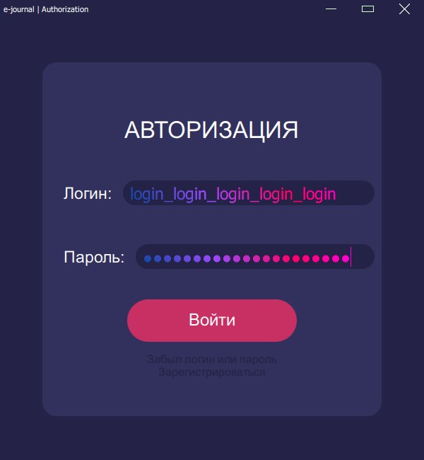
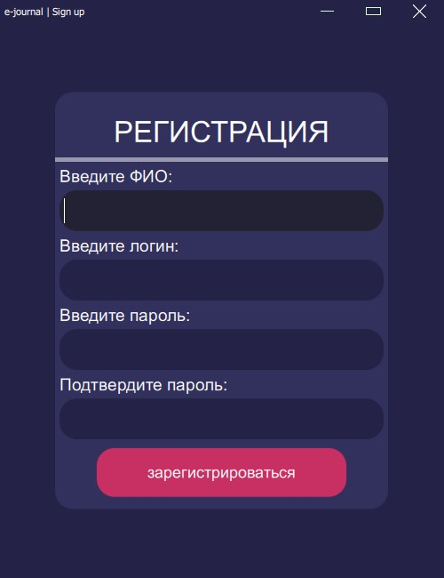
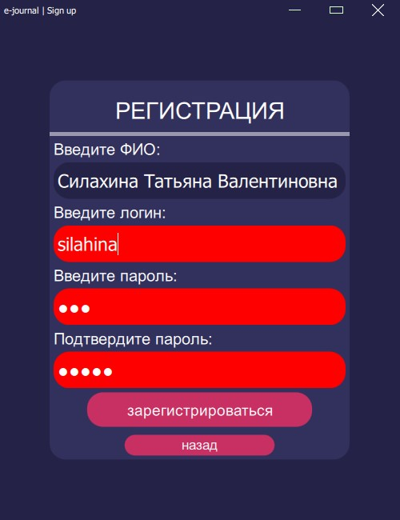
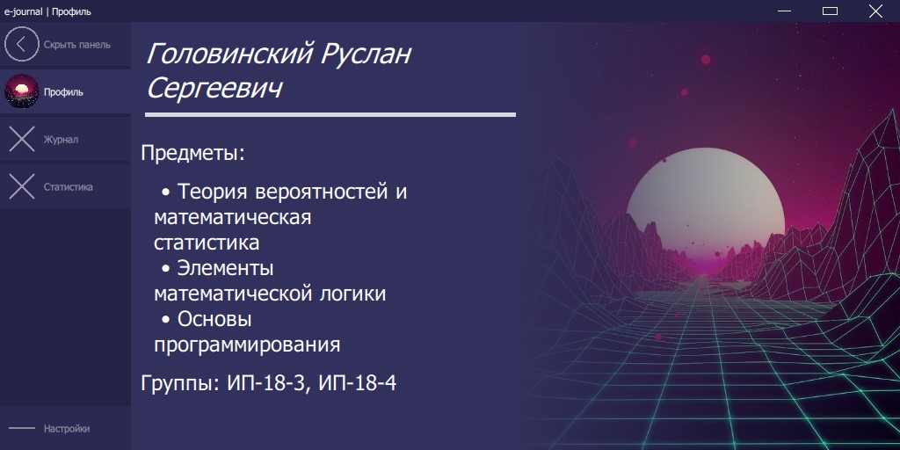
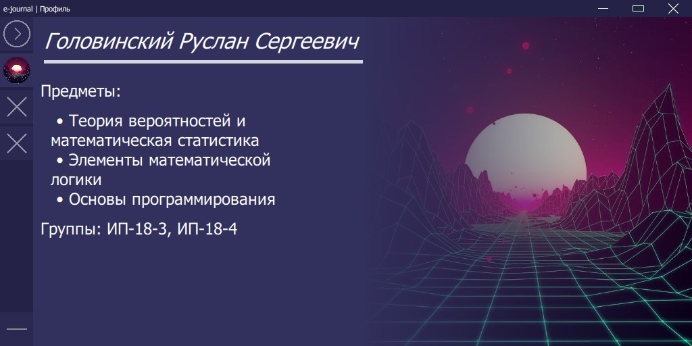

# e-journal
***
It's just my current individual project from my college practice

### Sign-in window:

  

### Sign-up window:

  
  
  

### Main menu:

#### Main menu, profile page:

  

#### Main menu with minimized left buttons:

  

### Global setting window:

  

### Schemes:
#### The scheme of all project:

  

#### The scheme of qml side:

  

#### The scheme of database:

  

***

Other pages are in process.
